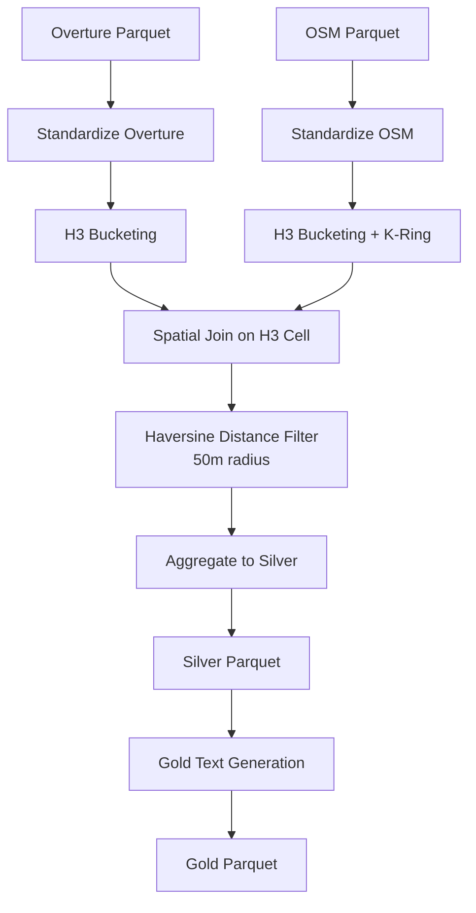
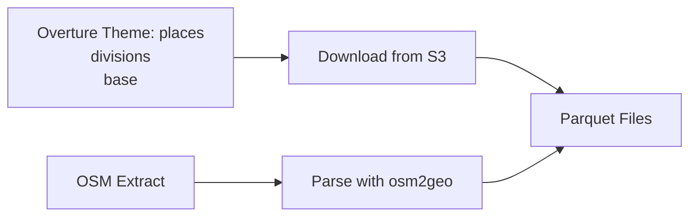
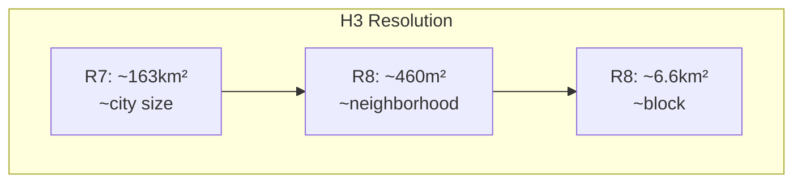
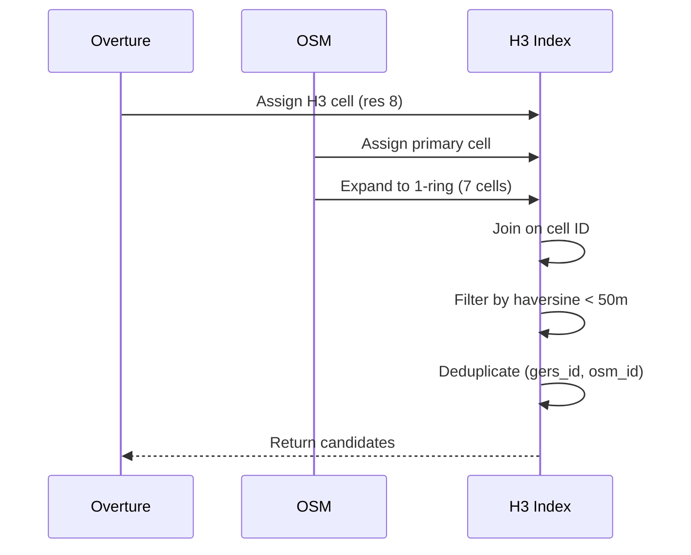

# Conflation Pipeline Documentation

## Overview

This pipeline conflates Overture Maps data with OpenStreetMap (OSM) data to create enriched POI records. The conflation process uses H3 spatial indexing for efficient candidate matching, followed by haversine distance filtering.

## Architecture



## Pipeline Stages

### 1. Data Ingestion



### 2. H3 Spatial Indexing

The pipeline uses H3 resolution 8 (~460m cell size) for POI matching:

- Each Overture record gets a primary H3 cell
- Each OSM record is exploded to cover its cell + 1-ring neighbors (7 cells total)
- This handles boundary cases where points are near cell edges



### 3. Conflation Algorithm



## Schema Transformations

### Input: Overture Parquet

| Column | Type | Description |
|--------|------|-------------|
| gers_id | string | Global Entity Reference System ID |
| lat | float | Latitude |
| lon | float | Longitude |
| name | string | Place name |
| category | string | Category |
| theme | string | Theme (places/divisions/base) |
| city | string | City name (optional) |

### Input: OSM Parquet

| Column | Type | Description |
|--------|------|-------------|
| osm_id | int | OSM object ID |
| lat | float | Latitude |
| lon | float | Longitude |
| amenity | string | Amenity type |
| name | string | Name |
| dog_friendly | bool | Dog-friendly flag |
| wheelchair | string | Wheelchair accessibility |
| wifi | string | WiFi availability |
| cuisine | string | Cuisine type |
| opening_hours | string | Opening hours |
| website | string | Website URL |
| phone | string | Phone number |
| payment | list[string] | Accepted payments |
| price_range | string | Price range |

### Output: Silver Parquet

| Column | Type | Description |
|--------|------|-------------|
| gers_id | string | Overture GERS ID |
| lat | float | Latitude |
| lon | float | Longitude |
| osm_ids | list[int] | Matched OSM IDs |
| osm_amenities | list[string] | Matched amenities |
| has_dog_friendly | bool | Any match is dog-friendly |
| osm_tags | dict | Merged OSM tags (JSON blob) |
| city | string | City name |
| theme | string | Theme |

### Output: Gold Parquet

| Column | Type | Description |
|--------|------|-------------|
| [all silver columns] | ... | ... |
| gold_text | string | Human-readable description |

### Example Gold Text

```
Bernardo's Trattoria is a restaurant in San Francisco.
It features Italian, pizza and is located at 37.77493, -122.41942.
```

## OSM Tag Extraction

The pipeline extracts extended OSM tags into a JSON blob:

```python
OSM_TAG_KEYS = [
    "wheelchair",
    "wifi", 
    "cuisine",
    "opening_hours",
    "website",
    "phone",
    "payment",
    "price_range",
    "dog_friendly",
    "atm",
    "fast_food",
    "takeaway",
    "delivery",
]
```

These are merged across all matched OSM objects per Overture record.

## Configuration

| Parameter | Default | Description |
|-----------|---------|-------------|
| radius_m | 50.0 | Haversine matching radius |
| h3_res | 8 | H3 resolution (7=neighborhood, 8=block) |
| k_ring | 1 | Neighbor ring size for boundary handling |

## Performance Considerations

### Memory Optimization

- H3 bucketing reduces join complexity from O(n×m) to O(n+m)
- K-ring expansion increases candidates but prevents false negatives at boundaries
- For large datasets, use sampling: `--sample-size 1000000`

### Caching

- Overture downloads are cached by bbox + release date
- Silver/Gold outputs are deterministic based on inputs

## Error Handling

1. **Missing columns**: Pipeline validates required columns exist
2. **Empty results**: Returns Overture rows with empty osm_ids
3. **Spatial errors**: Falls back to haversine-only matching

## Testing

Run tests with:
```bash
pytest tests/data/test_conflation.py -v
```

Key test scenarios:
- Basic Overture+OSM conflation
- No OSM matches (empty lists)
- Multiple OSM matches per Overture
- K-ring boundary handling
- Tag aggregation